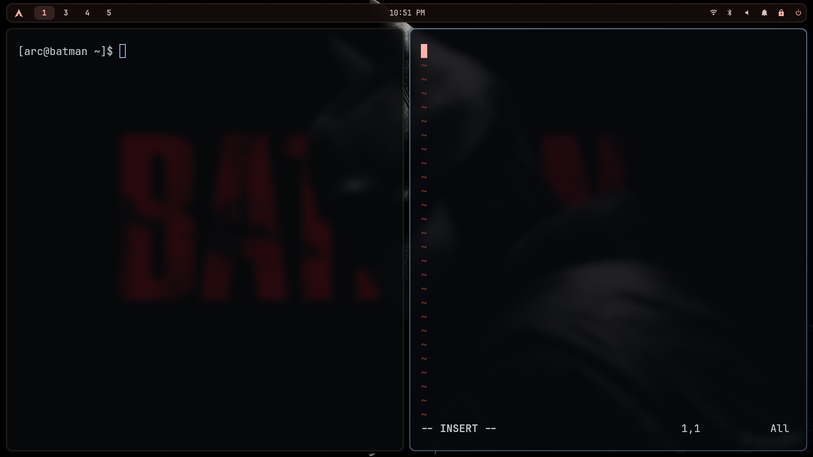
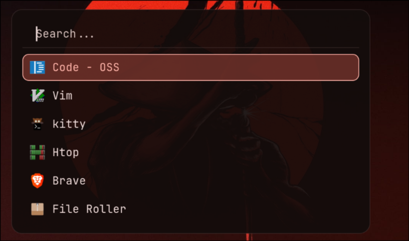
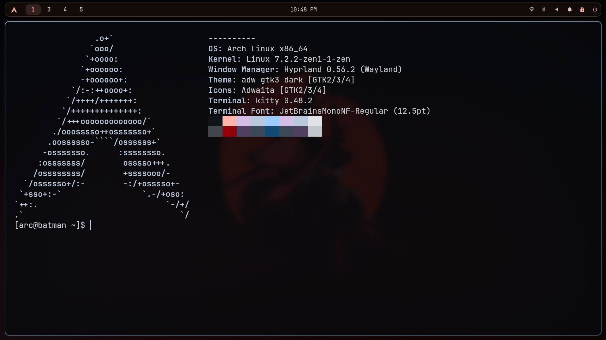
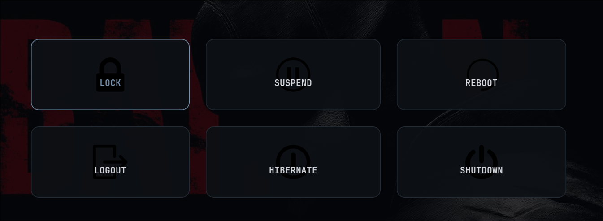
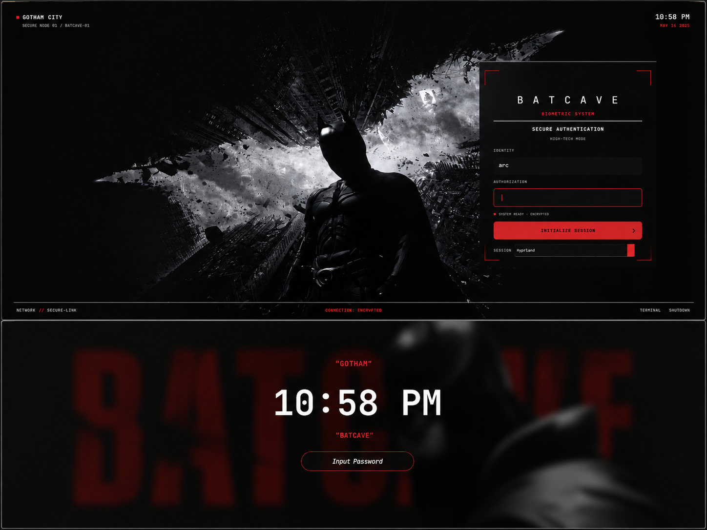
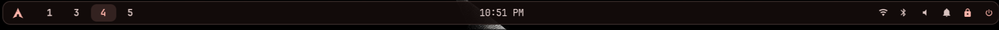

# BATCAVE

A minimal, dark, dynamic Hyprland rice for Arch Linux.

Batcave is a complete Hyprland desktop setup focused on clean design, practical tooling, and wallpaper-driven theming.

<p align="center">
  
</p>

## Screenshots

<p align="center">
  
  
</p>

<p align="center">
  
  
</p>

<p align="center">
  
</p>

## Features

- Hyprland
- Waybar
- Rofi
- Kitty
- Thunar
- SwayNC
- Hyprlock
- Wlogout
- Custom SDDM theme
- Matugen dynamic theming
- awww wallpaper transitions
- Dark GTK setup
- Papirus-Dark icons
- Bibata-Modern-Ice cursor
- JetBrainsMono Nerd Font
- Screenshot keybindings
- Lightweight configuration with minimal desktop clutter

## Components

| Component | Purpose |
| --- | --- |
| Hyprland | Wayland compositor |
| Waybar | Desktop panel |
| Rofi | Application launcher |
| Kitty | Terminal |
| Thunar | File manager |
| SwayNC | Notification center |
| Hyprlock | Lock screen |
| Wlogout | Power menu |
| SDDM | Login manager |
| Matugen | Dynamic color generation |
| awww | Wallpaper daemon |

## Dynamic Theming

Batcave uses the current wallpaper as the source for the desktop color palette.

```text
                     Wallpaper
                         │
                         ▼
                      Matugen
                         │
          ┌──────────────┼──────────────┐
          │              │              │
          ▼              ▼              ▼
       Waybar          Kitty           Rofi
                         │
                         ▼
                      Hyprlock
```

Changing the wallpaper updates the generated color palette used by the supported components while preserving the Batcave visual identity.

## Wallpapers

The wallpaper collection is maintained separately:

https://github.com/bat-fun/wallpaper

Place wallpapers in:

```text
~/Pictures/wallpapers
```

Change the wallpaper with:

```text
SUPER + A
```

or:

```bash
~/.local/bin/batcave-wallpaper
```

The wallpaper script selects a wallpaper, applies it with awww, generates the Matugen palette, refreshes themed applications, and records the selected wallpaper.

## Installation

### Requirements

Batcave currently targets:

- Arch Linux
- Wayland
- Hyprland

The environment uses:

```text
hyprland
waybar
rofi
kitty
thunar
swaync
hyprlock
wlogout
matugen
awww
networkmanager
network-manager-applet
blueman
pavucontrol
brightnessctl
playerctl
pipewire
pipewire-pulse
wireplumber
gtk3
gtk4
adw-gtk-theme
papirus-icon-theme
ttf-jetbrains-mono-nerd
fontconfig
```

Brave and Code - OSS are application defaults in the author's configuration.

## Automatic Installation

Clone the repository:

```bash
git clone https://github.com/bat-fun/batcave-hyprland.git
cd batcave-hyprland
```

Preview changes:

```bash
./install.sh --dry-run
```

Install:

```bash
./install.sh
```

The installer:

- detects the current user and home directory
- checks the operating system
- checks required dependencies
- offers missing packages
- backs up existing configuration before replacement
- installs Batcave configuration
- installs Batcave scripts
- configures supported GTK defaults
- initializes supported user services
- validates Batcave shell scripts
- never removes installed packages
- does not copy generated runtime files
- does not copy the wallpaper collection

### SDDM

The SDDM theme is optional because it changes system-wide login configuration.

The installer asks whether to install it during an interactive installation.

You can also explicitly request it:

```bash
./install.sh --sddm
```

## Manual Installation

Clone the repository:

```bash
git clone https://github.com/bat-fun/batcave-hyprland.git
cd batcave-hyprland
```

Install the required packages:

```bash
sudo pacman -S --needed \
  hyprland \
  waybar \
  rofi \
  kitty \
  thunar \
  swaync \
  hyprlock \
  wlogout \
  matugen \
  awww \
  networkmanager \
  network-manager-applet \
  blueman \
  pavucontrol \
  brightnessctl \
  playerctl \
  pipewire \
  pipewire-pulse \
  wireplumber \
  gtk3 \
  gtk4 \
  adw-gtk-theme \
  papirus-icon-theme \
  ttf-jetbrains-mono-nerd \
  fontconfig
```

Create the required directories:

```bash
mkdir -p \
  ~/.config/hypr \
  ~/.config/waybar \
  ~/.config/kitty \
  ~/.config/rofi \
  ~/.config/swaync \
  ~/.config/matugen \
  ~/.config/batcave \
  ~/.local/bin
```

Copy configuration:

```bash
cp -a .config/hypr/. ~/.config/hypr/
cp -a .config/waybar/. ~/.config/waybar/
cp -a .config/kitty/. ~/.config/kitty/
cp -a .config/rofi/. ~/.config/rofi/
cp -a .config/swaync/. ~/.config/swaync/
cp -a .config/matugen/. ~/.config/matugen/
cp -a .config/batcave/. ~/.config/batcave/
```

Copy Batcave scripts:

```bash
cp -a .local/bin/batcave-* ~/.local/bin/
chmod +x ~/.local/bin/batcave-*
```

Configure GTK:

```bash
gsettings set org.gnome.desktop.interface color-scheme 'prefer-dark' 2>/dev/null || true
gsettings set org.gnome.desktop.interface gtk-theme 'adw-gtk3-dark' 2>/dev/null || true
gsettings set org.gnome.desktop.interface icon-theme 'Papirus-Dark' 2>/dev/null || true
gsettings set org.gnome.desktop.interface cursor-theme 'Bibata-Modern-Ice' 2>/dev/null || true
gsettings set org.gnome.desktop.interface cursor-size 20 2>/dev/null || true
```

Refresh font cache:

```bash
fc-cache -f
```

Start user services:

```bash
systemctl --user enable --now pipewire.service
systemctl --user enable --now pipewire-pulse.service
systemctl --user enable --now wireplumber.service
systemctl --user enable --now swaync.service
```

### Wallpapers

Create the wallpaper directory:

```bash
mkdir -p ~/Pictures/wallpapers
```

Get wallpapers from:

https://github.com/bat-fun/wallpaper

Then initialize the Batcave wallpaper and theme:

```bash
~/.local/bin/batcave-init
```

### SDDM

Install the Batcave SDDM theme:

```bash
sudo mkdir -p /usr/share/sddm/themes/batcave
sudo cp -a sddm/batcave/. /usr/share/sddm/themes/batcave/
```

Create the configuration:

```bash
sudo mkdir -p /etc/sddm.conf.d
sudo tee /etc/sddm.conf.d/batcave.conf > /dev/null <<'EOF'
[Theme]
Current=batcave
CursorTheme=Bibata-Modern-Ice
Font=JetBrainsMono Nerd Font
EOF
```

Reboot to test the SDDM theme.

## Keybindings

The main modifier is `SUPER`.

| Shortcut | Action |
| --- | --- |
| `SUPER + Enter` | Kitty |
| `SUPER + B` | Brave |
| `SUPER + C` | Code - OSS |
| `SUPER + D` | Rofi |
| `SUPER + E` | Thunar |
| `SUPER + L` | Hyprlock |
| `SUPER + X` | Wlogout |
| `SUPER + W` | Restart Waybar |
| `SUPER + A` | Change wallpaper |
| `SUPER + V` | Toggle floating |
| `SUPER + P` | Toggle pseudo |
| `SUPER + J` | Toggle split |
| `SUPER + 1-0` | Switch workspace |
| `SUPER + Shift + 1-0` | Move window to workspace |
| `SUPER + Shift + P` | Area screenshot |
| `SUPER + Shift + F` | Full-screen screenshot |

## Screenshot Commands

Area screenshot:

```bash
mkdir -p ~/Pictures/Screenshots
grim -g "$(slurp)" \
  ~/Pictures/Screenshots/batcave-$(date +%Y-%m-%d_%H-%M-%S).png
```

Full-screen screenshot:

```bash
mkdir -p ~/Pictures/Screenshots
grim \
  ~/Pictures/Screenshots/batcave-full-$(date +%Y-%m-%d_%H-%M-%S).png
```

## Configuration

| Component | Location |
| --- | --- |
| Hyprland | `~/.config/hypr/` |
| Waybar | `~/.config/waybar/` |
| Kitty | `~/.config/kitty/` |
| Rofi | `~/.config/rofi/` |
| SwayNC | `~/.config/swaync/` |
| Matugen | `~/.config/matugen/` |
| Batcave | `~/.config/batcave/` |
| Scripts | `~/.local/bin/` |

Generated Matugen files are runtime files and are intentionally not tracked.

## Project Structure

```text
batcave-hyprland/
├── .config/
│   ├── batcave/
│   ├── hypr/
│   │   └── modules/
│   ├── kitty/
│   ├── matugen/
│   │   └── templates/
│   ├── rofi/
│   ├── swaync/
│   └── waybar/
├── .local/
│   └── bin/
│       ├── batcave-init
│       ├── batcave-theme
│       └── batcave-wallpaper
├── assets/
│   └── screenshots/
├── sddm/
│   └── batcave/
├── .gitignore
├── install.sh
└── README.md
```

## Updating

```bash
cd ~/dotfiles
git pull
```

Review configuration changes before applying them to the live system.

## Notes

Batcave currently targets Arch Linux and Hyprland.

Some settings are hardware- or application-specific and may need adjustment on another machine, especially:

- monitor configuration
- application commands
- display manager configuration
- hardware-specific settings

The installer is designed to reproduce the Batcave environment while keeping machine-specific values adaptable.

## Philosophy

Batcave is intentionally focused on:

- clean typography
- dark interfaces
- wallpaper-driven colors
- restrained visual effects
- practical desktop applications
- minimal visual clutter

It intentionally avoids unnecessary widgets and heavyweight desktop shell layers.

## Credits

Built with:

- Hyprland
- Waybar
- Rofi
- Kitty
- Thunar
- SwayNC
- Hyprlock
- Wlogout
- SDDM
- Matugen
- awww

Wallpaper collection:

https://github.com/bat-fun/wallpaper

## License

MIT
